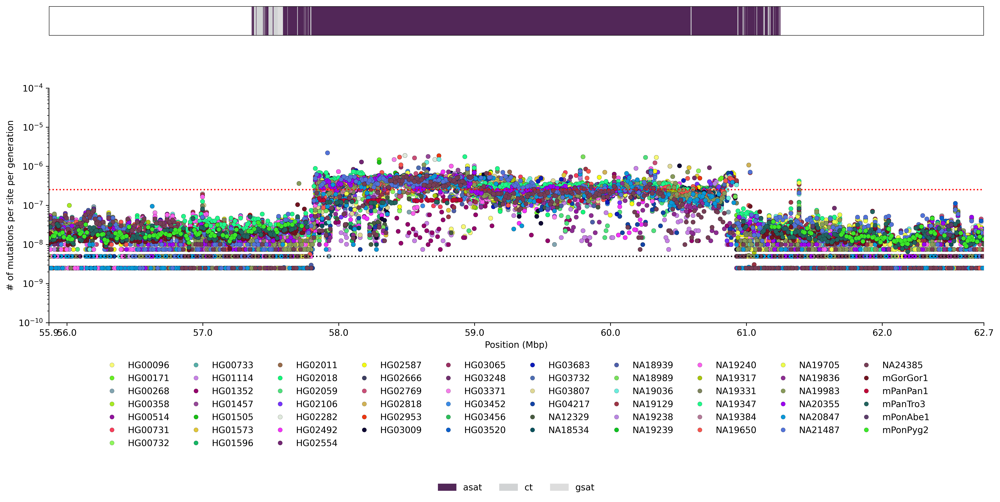

# Mutation Rate Analysis
Calculate mutation rate of query regions against a reference region.
* See https://www.nature.com/articles/s41586-024-07278-3#Sec6.



```bash
git clone https://github.com/logsdon-lab/Snakemake-MutationRate.git --recurse-submodules
```

## Configuration
```yaml
# Alignment memory.
mem: 100GB
# Alignment threads.
threads: 8
# Directories
output_dir: "results"
log_dir: "logs"
benchmarks: "benchmarks"
# Reference config.
reference:
  - name: reference
    # Sample fasta.
    path: reference.fasta
    # Chromosome specific bed files of windows to evaluate. Filename is region name.
    # Each window must have a chromosome name
    # Can be created from a region bedfile via, bedtools makewindows -w "${window_size}" -b "${bedfile}"
    bed:
      - reference_chr1.bed
    # Calculate rate for this region relative to everything else not in bed.
    bed_comparison: reference.bed
    # BED9 annotations to add to plot.
    bed_annotations: annotation.bed
# Regular expression patterns within fasta headers to find haplotype and matching chromosome.
# Used to group and filter alignments by exact match.
regex_sm_hap: "'(mat|pat|haplotype1|haplotype2|hap1|hap2|h1|h2)'"
regex_sm_chrom: "'_(hsa(.*?)|chr(.*?)|cen(.*?))[:_]'"
regex_ref_chrom: "(?:chr|hsa|cen)([0-9XY]{1,2})"
# Samples to align against each reference.
samples:
  - name: query
    # Query fasta
    path: query.fasta
    # Query bedfile. If none, entire region used.
    bed: query.bed
    # Minimap2 parameters. Important.
    # Preset of asm20 recommmended if highly divergent region.
    mm2_opts: -x asm20 --secondary=no -K 8G -t 8
    # Assumed divergence time from reference.
    divergence_time: 0
```

## Usage
```bash
# # Load singularity and bedtools
# module load singularity
which singularity
which bedtools

# Rerun mutation rate estimation.
# https://www.nature.com/articles/s41586-024-07278-3#Sec6
snakemake -p --configfile test/config/config_cen_var_glogsdon.yaml -j 40 -n
```
